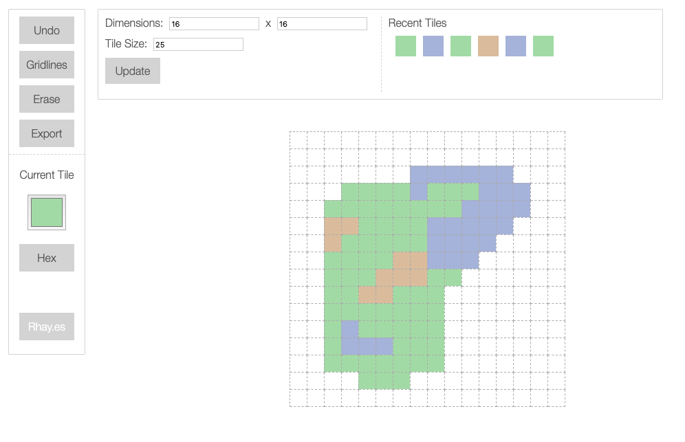

# Tile Map Creator

An `extremely portable` `browser-based` `tile-map creator` tool built inside one html file. Create tile maps of different sizes and colors and `easily export` to SVG format.

# How to Use

Use this tool online [here](https://strawstack.github.io/TileMapCreator/) or simply download [creator.html](https://github.com/strawstack/TileMapCreator/blob/master/creator.html) and open it in any browser anywhere! See `Documentation` section below for controls. 

# Screenshot

# Documentation

`Click` with the mouse inside the grid to place a tile. To remove a cell, toggle on `Erase` and click a cell. If you make a mistake, click the `Undo` button to revert a change. Change tile color by using the `color picker` (the colored square under the words "current tile") or click the `hex` button to enter a hex color. Click a `recent tile` to quickly change back to a previous color. Change the size of the grid with the `dimension` and `size` controls. When your drawing is complete, click `Export` to copy your tile map to the clipboard as SVG; SVG is a format that can be rendered clearly at any size. Read this article for more info about SVG: https://www.w3schools.com/graphics/svg_intro.asp

# Technology

This app is written in `Vanilla JavaScript` with a `Redux` state model in-mind. A `global state object` defines the state of the app at any time. A `deep copy` of this state object is created when a change is made. Sometimes the old state object is pushed to an undo array allowing a user to return to a previous state. All UI is re-rendered after each change according to the updated state object.
